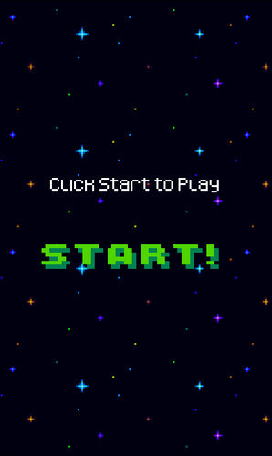
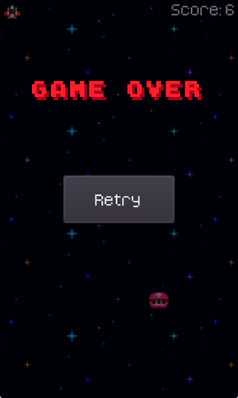

# 2D Game: Space Shooter

## Description

A tiny 2D space shooter game written in Godot using C#.

Controls:

Move left: A Key / Left Arrow

Move right: D Key / Right Arrow

Shoot: Space Key

## Screenshots

## Gameplay

## How to Play

1. Download or Clone the source code.
2. Import the game in Godot. Build & Play.

## System Requirements

- OS: Windows 7/8/10 64 bit, macOS,
- CPU: Dual-core processor, 2.0 GHz
- RAM: 1GB
- Storage: 50 MB available space

## Credits

Sprites from : [Grafxkid](https://grafxkid.itch.io)

## Follow Me

- [Twitter](twitter.com/rprav_n)
- [LinkedIn](linkedin.com/in/rprav-n)

Happy gaming!
